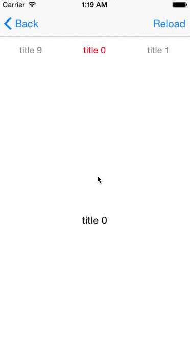

DCScrollView [](https://travis-ci.org/hirohisa/DCScrollView)
==================

DCScrollView is an extension of UIScrollView that scrolling through the content, the title scrolls with a delay like Etsy app for iOS.




Requirements
----------
- iOS 4.3+
- ARC

If your project's target is iOS 8.0+, use [PageController](https://github.com/hirohisa/PageController). PageController has high performance than DCScrollView. DCScrollView controls [UIView], PageController controls [UIViewController].

Used in Production
----------

- [ヤフオク!](https://itunes.apple.com/jp/app/yafuoku!-ru-zha-wu-liao!-ri/id356968629?mt=8)


Installation
----------

There are two ways to use this in your project:

- Copy `DCScrollView/*.{h.m}` into your project

- Install with CocoaPods to write Podfile
```ruby
platform :ios
pod 'DCScrollView',  '~> 1.1.0'
```


Usage
----------

### Set Delegate, DataSource

DCScrollView uses a simple methodology. It defines a delegate and a data source, its client implement.
DCScrollViewDelegate and DCScrollViewDataSource are like UITableViewDelegate and UITableViewDatasource.


### Reload

Reset cells and redisplays visible cells. Current page keep visible after reloading.

```objc
- (void)reloadData;
```

### Remove Cache

If UIViewController received memory warnings, control to clear the memory that DCScrollView has.

```objc
- (void)clearData;
```

Example
----------

- import `DCScrollView.h`
- implement `DCScrollViewDataSource` and `DCScrollViewDelegate`'s methods

### UIViewController


```objc


#import "DCScrollView.h"

@interface ExampleViewController ()

<DCScrollViewDataSource, DCScrollViewDelegate>

@end

@implementation ExampleViewController

- (void)viewDidLoad
{
    [super viewDidLoad];
    DCScrollView *scrollView = [[DCScrollView alloc]initWithFrame:self.view.bounds];
    scrollView.dataSource = self;
    scrollView.delegate = self;
}

- (NSInteger)numberOfCellsInDCScrollView:(DCScrollView *)scrollView
{
    return 10;
}

- (DCScrollViewCell *)dcscrollView:(DCScrollView *)scrollView cellAtIndex:(NSInteger)index
{
    NSString *identifier = @"Cell";
    DCScrollViewCell *cell = [scrollView dequeueReusableCellWithIdentifier:identifier];
    if (!cell) {
        cell  = [[DCScrollViewCell alloc] initWithReuseIdentifier:identifier];
    }

    return cell;
}

- (NSString *)titleOfDCScrollViewCellAtIndex:(NSInteger)index
{
    return @"title";
}

```


### will deprecate

```objc
- (void)setFont:(UIFont *)font textColor:(UIColor *)textColor highlightedTextColor:(UIColor *)highlightedTextColor
```

## License

DCScrollView is available under the MIT license.
